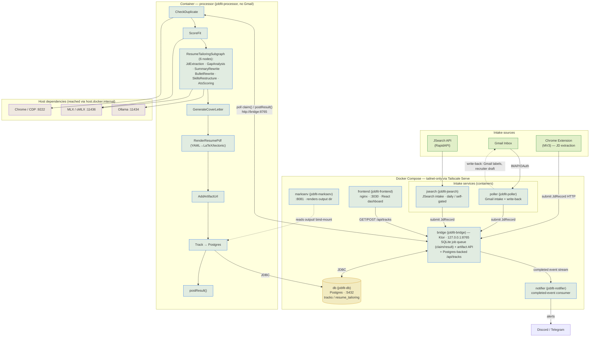

# Job Fit to Apply AI Suite - README

A monorepo AI pipeline that automates the complete job search workflow: Gmail inbox scanning → email classification → digest fan-out → job scraping → fit scoring → resume tailoring → cover letter generation → PDF rendering → recruiter reply drafting → Postgres tracking → dashboard management. A Chrome extension extends the same pipeline to job boards encountered during normal browsing.

Every service — **Postgres, the HTTP bridge, the artifact/markdown server, the dashboard, and the pipeline processor/poller/jsearch/notifier** — runs as a **Docker Compose** service; the tailnet-facing ones are exposed (and nothing else) via **Tailscale Serve**. Only the processor's browser/LLM dependencies (the logged-in Chrome/CDP, MLX, Ollama) stay on the host, reached from the container via `host.docker.internal`. Bring the whole stack up with `make up`; check it with `make doctor`.

---

## Architecture

> Rendered diagram: [`docs/architecture-diagram.md`](docs/architecture-diagram.md).



**Containerized services** (all bind host loopback only; reach them on your tailnet via Tailscale Serve — see [`docs/tailscale-serve.md`](docs/tailscale-serve.md)):

| Service | Container | Host bind | Tailnet URL |
|---|---|---|---|
| Postgres | `jobfit-db` | `127.0.0.1:5432` | — (internal only) |
| Bridge (Ktor) | `jobfit-bridge` | `127.0.0.1:8765` | `http://<tailscale-name>:8765` |
| Dashboard (nginx) | `jobfit-frontend` | `127.0.0.1:3030` | `http://<tailscale-name>:3030` |
| Artifact server (markserv) | `jobfit-markserv` | `127.0.0.1:8081` | `http://<tailscale-name>:8081` |
| Processor (pipeline) | `jobfit-processor` | — (outbound only) | — (internal only) |
| Steel Browser (scraping) | `jobfit-steel` | `${STEEL_BIND_ADDR:-127.0.0.1}:3000` | `http://<tailscale-name>:3000` (debug UI) |

**Browser scraping backend.** The Processor drives a browser only for LinkedIn, forced-CDP domains (e.g. Glassdoor), and as a fallback when plain-HTTP is blocked. Two backends, selected by `STEEL_BASE_URL`:
- **Steel Browser** (`jobfit-steel`, default when `STEEL_BASE_URL=http://steel:3000`) — self-hosted [Steel](https://github.com/steel-dev/steel-browser), built from source (the prebuilt images can't launch Chrome on Apple Silicon under Docker). It manages Chrome, persists the logged-in session (app-side `storageState` store), and exposes an **interactive debug URL** so you can re-auth from a phone over Tailscale. The Processor connects over the Compose network, resolving `steel` to an IP (Chrome DevTools rejects non-IP `Host` headers). Sign in once via `http://<tailscale-name>:3000` (no auth on the UI — tailnet only). When a board later drops its session, the re-auth alert links to the **tap-to-sign-in endpoint** (`STEEL_SIGNIN_PUBLIC_URL`, port 3100 on the Processor) rather than at the live scrape session — that session is released at batch close, so its debug link is dead by the time you read the alert. Tapping creates a 30-min session, parks it on the board's login page, and merges cookies every 10s until you're in (see the pipeline README). Steel can **wedge** (`createSession` → HTTP 500) while its API still answers `200`: Chrome runs unreaped under a shell PID 1, so a crash leaves a stale `SingletonLock` (its PID still "alive" as a zombie) and Chrome then refuses to relaunch. The Compose service runs `init: true` to reap those children (freeing the PID so Chrome clears the lock) and wipes any leftover `SingletonLock` on start; the healthcheck probes real session creation so any remaining wedge shows as unhealthy, and the optional `com.jd.steel-watchdog` launch agent auto-restarts it as a last resort (see the pipeline README).
- **Host Chrome/CDP** (`:9222`, fallback when `STEEL_BASE_URL` is blank) — a logged-in Chrome on the host reached via `host.docker.internal` (the entrypoint resolves it to an IP for the same Host-header reason).

**On the host:** the local model servers (oMLX `:11436`, Ollama `:11434`) remain, plus the host Chrome/CDP (`:9222`) if used as the fallback backend. Every pipeline service — including the Processor — is a container: `jobfit-processor` reaches the bridge over the Compose network (`http://bridge:8765`) and dials the host model servers via `host.docker.internal`. Gmail intake + write-back runs in `jobfit-poller`; the Processor never touches Gmail.

### Queue concurrency guards

The `--max-emails` cron run is protected against re-entrant overlap at two levels:

1. **`heartbeat_check.sh`** — checks the PID file before starting; exits immediately with `ALREADY_RUNNING` if the previous run is still polling the bridge.
2. **`-label:Processing`** — the Gmail search query excludes emails already labeled in-flight, so a second run that slips past the PID check still won't re-ingest the same email.

---

## Repos

| Repo | Language | Description |
|---|---|---|
| `services/job-fit-apply-ai-pipeline` | Kotlin / JVM 21 | Email ingestion + processing pipeline; CLI entry point for all modes. Runs as the `jobfit-processor` container (reaches the host's Chrome/CDP + local LLMs via `host.docker.internal`). |
| `services/job-fit-apply-ai-bridge` | Kotlin / JVM 21 | Ktor bridge — SQLite job queue, claim/result/artifact API, and the Postgres-backed `tracks` API for the dashboard. **Containerized** (`jobfit-bridge`). |
| `apps/job-fit-apply-ai-extension` | JavaScript (MV3) | Chrome extension — JD extraction from job boards, real-time progress UI. |
| `apps/job-fit-apply-ai-backlog` | TypeScript / React 18 | Vite dashboard — live job table, status management, artifact downloads. **Containerized** (`jobfit-frontend`, served by nginx). |

---

## Prerequisites

### Everyone
- **Docker Desktop** (with Compose v2) — runs Postgres, the bridge, the dashboard, and markserv. Enable **Settings → General → Start Docker Desktop when you sign in** so the stack returns after a reboot.
- **Tailscale** — the containers are tailnet-only; `tailscale serve` (host-side) exposes them. No Tailscale runs inside Docker.
- **GNU Make** — for the `make up` / `make doctor` bootstrap.

### Host worker — `services/job-fit-apply-ai-pipeline`
- JDK 21 + Gradle (wrapper included)
- **MLX/oMLX** (`:11436`) and/or **Ollama** (`:11434`) with models, or cloud API keys (MiniMax / DeepSeek / Anthropic)
- A logged-in Chrome (LinkedIn/job boards) reachable over **CDP** (`:9222`) — the only browser the pipeline uses; the container ships no Chromium (PDF rendering is LaTeX/tectonic, baked into the image)
- **Gmail OAuth credentials** — `gmail_credentials.json` from Google Cloud Console (Gmail API enabled, OAuth 2.0 desktop client)

### Dashboard / bridge development
- Node.js 20+ (only needed for local dashboard dev; the container build handles production)
- JDK 21 (only needed for local bridge dev / running the test suite)

> **No Supabase.** The `tracks` / `resume_tailoring` schema is created automatically by the Postgres container from `db/init/001_schema.sql` on first boot.

---

## Setup

### 1. Bring up the containers

```bash
# From the repo root:
cp .env.example .env          # optional — every value has a compose default
make up                       # docker compose up -d  +  tailscale serve
make doctor                   # verify the whole stack (read-only)
```

`make up` starts `db`, `bridge`, `frontend`, and `markserv`, then configures Tailscale Serve for `:8765`, `:3030`, and `:8081`. Config lives in the root `.env` (see `.env.example`); the `DATABASE_URL` the containers use is derived from `POSTGRES_*` and points at the compose service `db`.

Migrating existing rows from a previous Supabase project? See `scripts/migrate_supabase_to_postgres.py` (idempotent REST → Postgres copy).

### 2. Host worker — `services/job-fit-apply-ai-pipeline`

```bash
cd services/job-fit-apply-ai-pipeline

# Initialize your profile (generates candidate_profile.json & generated_resume.html)
./gradlew run --args="--init-profile path/to/your_resume.pdf"

# First-time Gmail OAuth, then verify (Gmail lives in the Poller — Phase 1)
( cd ../job-fit-apply-ai-poller && ./gradlew run --args="--reauth" )
( cd ../job-fit-apply-ai-poller && ./gradlew run --args="--check-token" )

# Test end-to-end on a sample JD (no Gmail required)
./gradlew run --args="--test"

# Everything — including the Processor — runs under Docker Compose. Bring the stack up:
make up            # docker compose up -d + Tailscale Serve

# The Processor image bundles the LaTeX toolchain (tectonic + Roboto); the first
# `docker compose build processor` warms tectonic's package cache as a build gate.
# Host prerequisites the Processor reaches via host.docker.internal: the CDP Chrome
# (scripts/launch-chrome-cdp.sh + its launchd watchdog) and the local model servers.
```

The `processor` service sets `DB_BACKEND=postgres` and `DATABASE_URL=postgresql://…@db:5432/…` in `docker-compose.yml`, writing `tracks` directly over JDBC to the `jobfit-db` container. Its personal inputs (`.env`, `resume.yaml`, `config/candidate_profile.yaml`) are bind-mounted read-only from `services/job-fit-apply-ai-pipeline/`.

### 3. Chrome Extension

1. Chrome → `chrome://extensions` → enable Developer mode
2. Load unpacked → select `apps/job-fit-apply-ai-extension/`
3. Point it at the bridge's tailnet URL in `config.js`:

```js
export const BRIDGE_API_URL = 'http://your-machine.ts.net:8765';
```

### 4. Dashboard — local development (optional)

The production dashboard is the `jobfit-frontend` container. For local dev against the live bridge:

```bash
cd apps/job-fit-apply-ai-backlog
npm install
echo "VITE_API_BASE_URL=http://localhost:8765" > .env   # or your tailnet bridge URL
npm run dev                     # http://localhost:3001
```

`VITE_API_BASE_URL` is the bridge URL the browser calls; it's baked into the container bundle at build time via the compose build arg.

---

## Automation (Docker + cron)

| Process | Runs as | Command | Schedule |
|---|---|---|---|
| `db` / `bridge` / `frontend` / `markserv` / `processor` / `poller` / `jsearch` / `notifier` | Docker Compose | `make up` (`restart: unless-stopped`) | continuous |
| Tailscale Serve (`:8765`,`:3030`,`:8081`) | host `tailscaled` | `scripts/setup-tailscale-serve.sh` | persisted across reboot |
| `jobfit-processor` | Docker Compose | pipeline `--processor` (LLM pipeline, no Gmail) | continuous |
| `jobfit-poller` | Docker Compose | poller `--poll` (Gmail intake + write-back) | continuous |
| `jobfit-jsearch` | Docker Compose | jsearch `--once` (JSearch API intake) | daily (self-gated) |
| `jobfit-notifier` | Docker Compose | notifier `--poll` (Discord/Telegram from the completed-event stream) | continuous |

The containers and worker must be up before the cron jobs fire — run `make doctor` to confirm.

### Make targets

| Target | Action |
|---|---|
| `make up` | `docker compose up -d` + configure Tailscale Serve |
| `make down` | Stop & remove containers (named volumes / data kept) |
| `make restart` | Recreate containers from current compose config |
| `make status` | Container status + Tailscale Serve config |
| `make serve` | (Re)configure Tailscale Serve only |
| `make doctor` | Read-only health check of the whole stack |
| `make logs` | Tail container logs |
| `make e2e` | Full black-box E2E cycle on an isolated compose slice (up + run + down) |
| `make e2e-up` / `e2e-run` / `e2e-down` | Same, split — `e2e-run` is the fast ad-hoc loop |
| `make e2e-multi` | Dual-slice E2E: adds a prod-shaped "source" slice + the multi-instance scenarios |
| `make e2e-logs` | Tail the e2e slice's container logs |
| `make e2e-smoke` | Legacy full-fat smoke against the REAL stack + real local models |
| `make replay ARGS="--last 1"` | Replay prod bridge jobs into the test instance (`scripts/replay-jobs.sh`) |

Every stack-facing target takes `INSTANCE=<name>` (default `prod`) — e.g. `make up INSTANCE=test`
drives a second, fully isolated stack from `.env.test`. See [docs/multi-instance.md](docs/multi-instance.md).

---

## LLM Configuration (`Config.kt`)

By default, the pipeline uses local models via MLX/oMLX (`:11436`) and Ollama (`:11434`). You can route individual nodes to cloud providers (Ollama Cloud, DeepSeek, MiniMax, Anthropic) by setting the respective `*_MODEL`, `*_BASE_URL`, and `*_API_KEY` in `.env`. See `tuner/env-llm-tuner/` for curated per-node model presets.

```kotlin
val SCAN_MODEL               // fast classification
val SCRAPE_MODEL
val SCORE_MODEL              // rubric-based fit scoring
val RESUME_REASONING_MODEL   // deep reasoning (prefer a dense ≥27B model)
val COVER_LETTER_MODEL
val DRAFT_REPLY_MODEL
val SKILLS_MODEL             // skills restructure

val FIT_THRESHOLD         = 50   // below this: tracked but not tailored
val DUPLICATE_WINDOW_DAYS = 30   // dedup window: company × role × location
val GMAIL_MAX_EMAILS      = 3    // emails per batch run
```

---

## Gmail Search Query

The default query fetches emails from the last 7 days, from INBOX only, excluding already-processed or in-flight messages:

```
newer_than:7d in:inbox -label:JD_Not_Found -label:Recruiter_Response_Required -label:Processing
```

Override `GMAIL_SEARCH_QUERY` in `.env` or `Config.kt` to target different senders or date ranges.

**Gmail labels applied by the pipeline:**

| Outcome | Label | Inbox Action |
|---|---|---|
| Submitted to bridge, awaiting worker | `Processing` | Kept in INBOX |
| Recruiter draft created | `Recruiter_Response_Required` | Star, mark unread, keep in INBOX |
| Not a job posting | `JD_Not_Found` | Mark unread, keep in INBOX |
| Digest processed | `JD_Processed_Digest` | Archive |
| Job processed | `JD_Processed` | Archive |

---

## Skill Files (Prompt Templates)

All LLM prompts live in `src/main/resources/skills/` as `.md` files. Loaded at runtime — edit without recompiling.

| File | Node |
|---|---|
| `SCAN_SKILL.md` | ScanEmailNode — recruiter email extraction |
| `SCRAPE_SKILL.md` | ScrapeJdNode — job page structured extraction |
| `SCORE_SKILL.md` | ScoreFitNode — fit scoring + JD field extraction |
| `JD_EXTRACTION_SKILL.md` | JdExtractionNode |
| `GAP_ANALYSIS_SKILL.md` | GapAnalysisNode |
| `SUMMARY_REWRITE_SKILL.md` | SummaryRewriteNode |
| `BULLET_REWRITE_SKILL.md` | BulletRewriteNode |
| `SKILLS_RESTRUCTURE_SKILL.md` | SkillsRestructureNode |
| `ATS_SCORING_SKILL.md` | AtsScoringNode |
| `DRAFT_REPLY_SKILL.md` | CreateDraftReply — recruiter reply generation |

---

## Adapting for Your Own Job Search

1. **Initialize your profile** — Run `./gradlew run --args="--init-profile path/to/resume.pdf"` to generate your `candidate_profile.json` and personal `generated_resume.html`.
2. **Update `SCORE_SKILL.md`** — rewrite the scoring rubric to reflect your background and target roles.
3. **Tune `FIT_THRESHOLD`** — lower for more tailoring, raise to be more selective.
4. **Tune `DUPLICATE_WINDOW_DAYS`** — how far back to look when deduplicating.
5. **Update `GMAIL_SEARCH_QUERY`** — adjust to match your inbox structure.
6. **Update `DRAFT_REPLY_SKILL.md`** — personalize the recruiter reply tone and signature.

---

## Digest Fan-Out: Supported Platforms

The pipeline extracts individual jobs from digest emails sent by:

| Platform | Parser |
|---|---|
| LinkedIn | Line-block splitting on `---` separators |
| Glassdoor | HTML anchor scraping with salary extraction |
| Lensa | `<table>` card extraction |
| Monster | `<a strong>` element matching |
| JobLeads | `View job:` line extraction |
| JobRight | `jobright.ai/jobs/info/` URL extraction + match-percentage parsing |
| Welcome to the Jungle | SendGrid click URL extraction |

Max 25 jobs per digest. Each child job is independently scraped, deduplicated, scored, and — if fit qualifies — tailored.

---

## Recruiter Reply Draft Flow

For recruiter emails that complete the tailor path:

1. `DRAFT_REPLY_SKILL.md` template is filled with role, company, fit score, and strengths
2. LLM generates a reply (temp=0.3 for natural prose variation)
3. Recruiter email body is **sanitized** before reaching the LLM — lines matching prompt injection patterns are stripped
4. RFC 2822 MIME message built with threading headers (In-Reply-To, References)
5. Tailored resume PDF and cover letter attached
6. Gmail Draft created via Compose API
7. Original email labeled `Recruiter_Response_Required`, starred, marked unread

**Nothing is sent automatically.** The user reviews and sends the draft manually.

---

## Output Structure

```
output/
└── 20260405_143022_acme_corp_staff_sdet/
    ├── tailored_resume.html          # Tailored HTML (source for PDF)
    ├── YourName_Staff_SDET.pdf       # LaTeX (tectonic) - rendered PDF
    ├── cover_letter.txt              # Cover letter
    ├── score_fit.txt                 # Fit score + reasoning
    ├── gap_analysis.json             # Skills gap table
    ├── tailored_summary.txt          # Rewritten professional summary
    ├── tailored_bullets.txt          # Rewritten experience bullets
    ├── restructured_skills.txt       # Reordered skills section
    └── ats_score.txt                 # ATS composite scorecard
```

The pipeline writes into `${JFAA_DATA_ROOT}/pipeline-output/` on the host (the Processor's `/app/output`; see [docs/data-root-migration.md](docs/data-root-migration.md)), which is bind-mounted read-only into `jobfit-markserv` and rendered at `http://<tailscale-name>:8081/<job-dir>/report.md`. Browser-triggered jobs also expose artifacts via the bridge at `GET /api/jobs/{id}/resume.pdf` and `/cover_letter.txt`.

---

## Testing

```bash
# Pipeline (Kotlin) — unit + gateway/live-Postgres tests
cd services/job-fit-apply-ai-pipeline && ./gradlew test

# Bridge — unit + integration (spins an isolated jobfit_test DB in the running Postgres)
cd services/job-fit-apply-ai-bridge && ./gradlew test

# Dashboard — unit tests
cd apps/job-fit-apply-ai-backlog && npm run test:unit

# Dashboard — E2E (Playwright, requires the running app)
cd apps/job-fit-apply-ai-backlog && npm run test:e2e

# Extension
cd apps/job-fit-apply-ai-extension && npm test

# Black-box E2E: Bridge → Processor → Notifier on an isolated compose slice
make e2e

# Whole-stack health (read-only)
make doctor
```

### Black-box E2E (`services/job-fit-apply-ai-e2e`)

`make e2e` runs a scenario-based black-box suite through the Bridge and asserts the whole
chain — bridge status, rendered artifacts, markserv, `tracks`, `/api/tracks`, the completed
feed, and Discord/Telegram payloads — against a **fake LLM** in the test JVM. Besides the
pre-scraped happy path, deterministic scenarios cover low-fit SKIP, one ATS refinement pass,
captured-page intake through `/api/pages`, and direct recruiter-email intake through
`/api/emails` (including draft-reply composition). This pins exact values and branch behavior,
not merely "a file exists". Design doc: [`docs/e2e-testing-plan.md`](docs/e2e-testing-plan.md).

It runs in its own compose project (`jobfit-e2e-<checkout hash>`, alternate ports, state
in a gitignored `./.e2e/`), so it is safe to run while the production stack is up. Two
things worth knowing:

- **`E2E_FAKE_LLM_PORT` defaults to 21436, not 11436.** 11436 is production oMLX. Binding
  both is possible but the more-specific socket wins, so sharing the port makes the e2e
  run silently hit real models — or, with oMLX down, makes the fake answer the *production*
  processor with fixture data. `REAL_LLM=1` selects 11436 on purpose and skips the fake.
- **Tier A vs Tier B.** The happy path is one scenario-level test with grouped checks, so
  submission, waiting, and verification are included in its reported duration. Tier A is
  structural and also holds against a real model; Tier B pins exact values (`fit_score`,
  the LLM call sequence, canned content) and catches a *silently degraded* run. The four
  deterministic branch/intake scenarios are tagged `tier-b` because their contracts depend
  on planned fake responses. `-PexcludeTags=tier-b` therefore runs structural HappyPath only,
  and `REAL_LLM=1` passes it. Belt and braces: those scenarios also skip themselves under
  `E2E_REAL_LLM=1`, since a bare `./gradlew test` (what CI runs) never sees the property.

DB-backed tests (`PostgresGatewayLiveTest`, `TracksApiTest`) connect over TCP to the running `jobfit-db` container and **skip automatically** when it isn't up, so they're CI-safe. `TracksApiTest` self-provisions an isolated `jobfit_test` database so it never touches real data.

CI runs the test suites on every push to `main` and publishes a combined Allure report to GitHub Pages.

---

## Known Constraints

- **The stack relies on Docker Desktop being set to start on login** — with `restart: unless-stopped`, the containers return after a reboot only if Docker Desktop auto-starts. `tailscale serve` config is persisted by `tailscaled` and restored automatically.
- **Every service is containerized, including the Processor.** `jobfit-processor` reaches the bridge over the Compose network (`http://bridge:8765`) and dials the host's model servers (oMLX/Ollama) and logged-in Chrome/CDP via `host.docker.internal` — verified working on Docker Desktop 29.x (its host proxy reaches loopback-bound ports, so no socat shim is needed). PDF rendering is `YAML → LaTeX (tectonic)` baked into the image, so the container ships no browser. The remaining host prerequisites are just the model servers and the CDP Chrome (kept warm by the `com.jd.chrome-cdp` launchd watchdog).
- **LinkedIn scraping requires a logged-in Chrome profile** reachable over CDP. Set `CHROME_PROFILE_DIRECTORY` / `CHROME_CDP_ENDPOINT` in `.env`.
- **Local LLM quality scales with model size.** The 6-node tailoring subgraph produces significantly better results with dense ≥27B models; smaller models tend to hallucinate resume content.
- **Containers are tailnet-only.** They bind `127.0.0.1` and are exposed via Tailscale Serve — not reachable from the LAN or the public internet. Run `make serve` if a service isn't reachable on the tailnet.
- **Gmail OAuth tokens expire.** Refresh from the Poller container: `docker compose run --rm poller --reauth` (browser-free — it prints the consent URL, you paste the redirect URL back); `--check-token` verifies status without a full run.
- **Fit scores are LLM-generated and model-dependent.** Tune the scoring rubric in `SCORE_SKILL.md` until scores feel calibrated to your profile.
- **Draft replies are not sent automatically.** Review every draft in Gmail before sending.
