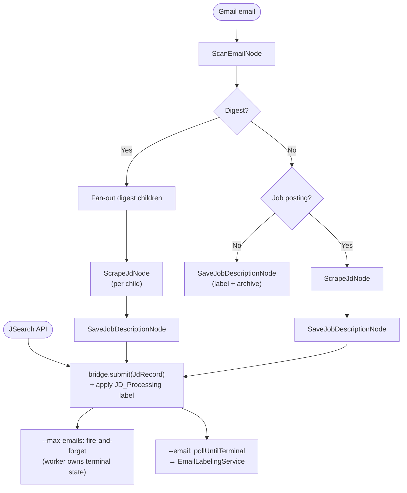
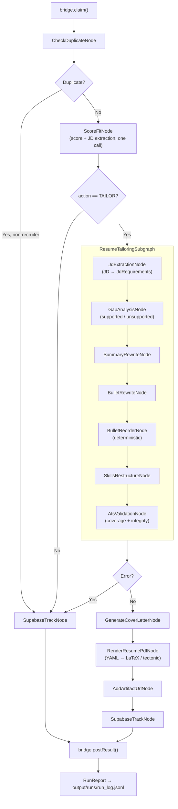

# JD Pipeline (Kotlin)

[](https://github.com/dkkyai/jd-pipeline-kotlin/actions/workflows/ci.yml)
[](LICENSE)
[](https://openjdk.org/projects/jdk/21/)

A Kotlin pipeline that turns inbound job opportunities into tailored resume + cover letter packets, end-to-end. It reads from Gmail or the JSearch API, scores each role against your candidate profile, and — for jobs above the fit threshold — rewrites your resume, generates a cover letter, renders a PDF, and tracks the application in Supabase.

The pipeline is split into two halves connected by the bridge job queue:

- **IngestionPipeline** — scan → scrape → save → submit to bridge
- **ProcessingPipeline** — duplicate-check → score → tailor → PDF → track (run by the processor)

## What it does

- Fetches recruiter emails and job-board digests from Gmail, or pulls live listings from the JSearch API.
- Classifies the email, expands digests into per-job records, and scrapes each job page (HTTP-first + schema.org JSON-LD for most boards; the logged-in host Chrome over CDP for LinkedIn and challenge-prone sites).
- Submits each ingested job to the bridge queue; `--max-emails` is fire-and-forget while `--email` polls the single job to completion.
- The processor claims jobs from the queue and runs the processing pipeline: deduplicates, scores fit, runs `ResumeTailoringSubgraph`, renders a tailored HTML preview + PDF (YAML → LaTeX/tectonic), and appends a run record to `output/runs/run_log.jsonl`.
- Tracks every job in Supabase and, when the source is a recruiter email, drafts a reply grounded in your résumé + `candidate_profile.yaml` — it only answers questions the profile supports, and opens by asking for the client/budget when the recruiter withheld them.

## Quick start

After cloning, one command populates every personalised file from your existing resume:

```bash
./gradlew run --args="--init-profile path/to/resume.yaml"
```

Your résumé is authored as structured YAML — see `src/main/resources/resume/resume.template.yaml` for the shape (demographics, summary, experience with categorised bullets, projects, education, labelled skill groups).

`--init-profile` installs your résumé as `resume.yaml`, scaffolds a slim `config/candidate_profile.yaml` (the preferences + scoring aids a résumé can't supply: visa, comp, work arrangement, target title, core strengths, …), opens `$EDITOR` to fill in the `__TODO__` fields, then renders `generated_resume.html` (deterministically, no LLM).

> You don't need Gmail or Supabase configured to run `--init-profile`. Those layers come in once you want to drive the pipeline from real email or persist scored jobs.

## Pipeline

### Ingestion (`--max-emails`, `--email`, `--jsearch`)



`--max-emails` is **fire-and-forget**: it submits each job, applies the `JD_Processing`
label, and returns — the processor drives the job to completion and (for recruiter emails)
creates the draft reply and applies `Recruiter_Response_Required`. `--email` instead
polls the single job to completion and then applies the terminal label.

### Processing (`--processor`)



After every job the processor appends a structured record (score, action, error,
`jdTextLen`, board, duration) to `output/runs/run_log.jsonl`. This durable per-job log
is what the **run analyzer** reasons over — see [`tuner/run-analyzer`](tuner/run-analyzer/README.md).

### Tailoring subgraph — what it produces

For every tailored job, `ResumeTailoringSubgraph` writes to `output/<timestamp>_<company>_<role>/`:

| File | Description |
|---|---|
| `tailored_resume.html` | Tailored HTML preview rendered from your `TailoredProfile` (served by markserv) |
| `tailored_resume.yaml` | Tailored résumé in the canonical YAML schema — the input to the PDF renderer |
| `tailored_resume.tex` | Intermediate LaTeX from `yaml_to_tex.py` (kept for debugging) |
| `<AUTHOR_NAME>_<Role>.pdf` | PDF rendered from `tailored_resume.yaml` via LaTeX (tectonic) |
| `tailored_summary.txt` | Rewritten professional summary |
| `tailored_bullets.txt` | Original → rewritten bullet pairs with must-have hits + quantified/seniority flags |
| `restructured_skills.txt` | JD-relevance-ordered skill groups (+ skills dropped for this role) |
| `ats_report.txt` | Validation report: must-have coverage %, missing/unreachable terms, integrity leaks, sub-scores, improvements |
| `gap_analysis.json` | Machine-readable supported / unsupported / missing-but-supported partition |
| `cover_letter.txt` | Tailored cover letter |
| `score_fit.txt` | Fit score, reasoning, strengths, gaps |

## Requirements

- **Java 21** (Temurin / Adoptium recommended)
- **Gradle wrapper** — bundled, use `./gradlew`
- **At least one LLM backend**: local Ollama, MiniMax cloud, DeepSeek cloud, or Ollama Cloud
- **Logged-in Chrome over CDP** (only if you intend to scrape LinkedIn/challenge-prone pages — the pipeline attaches to your host Chrome at `CHROME_CDP_ENDPOINT`, never launches its own)
- **Gmail OAuth credentials** (only if you want to drive the pipeline from your inbox)
- **Bridge service running** (the `jobfit-bridge` container, or `./gradlew run` in the bridge directory)

## First-time setup: `--init-profile`

```bash
./gradlew run --args="--init-profile path/to/resume.yaml"
```

What it does:

1. Validates your résumé YAML (`resume.yaml` shape — see `resume.template.yaml`).
2. Installs it as the canonical `src/main/resources/resume/resume.yaml`.
3. Scaffolds `config/candidate_profile.yaml` from `candidate_profile.template.yaml` and opens it in your `$EDITOR` so you can fill in the preference + scoring-aid `__TODO__` fields a résumé cannot supply (visa, target compensation, work arrangement, target title, core strengths). Save and exit when done. Everything derivable from the résumé — `years_experience` (from the dates), languages, and domain expertise (from the skill groups) — is computed automatically, not stored here.
4. Renders `src/main/resources/resume/generated_resume.html` **deterministically** from the merged profile (no LLM).

The personal files (`resume.yaml`, `candidate_profile.yaml`, `generated_resume.html`) are **gitignored** — your personal data never gets committed.

> **Backups:** any pre-existing copy of a generated file is moved aside with a timestamped `.bak` suffix before being overwritten.

## Environment + LLM setup

Copy `.env.example` to `.env` and fill in at least one LLM backend.

### LLM backend (pick one)

| Backend | How to enable | Notes |
|---|---|---|
| **Ollama (local)** | Run `ollama serve`; leave `OLLAMA_LOCAL_BASE_URL=http://localhost:11434` | Free, runs on your machine |
| **Ollama Cloud** | Set `OLLAMA_API_KEY` and append `:ollama-cloud` to any model name | Pay per token |
| **MiniMax** | Set `MINIMAX_API_KEY`, use `:cloud` suffix (e.g. `SCORE_MODEL=MiniMax-M2.7:cloud`) | Strong long-context performance |
| **DeepSeek** | Set `DEEPSEEK_API_KEY`, use `:cloud` suffix (e.g. `SCORE_MODEL=deepseek-reasoner:cloud`) | `deepseek-reasoner` for chain-of-thought scoring |

### Optional integrations

Gmail (drives email-sourced runs):
```bash
./gradlew run --args="--reauth"        # one-time OAuth flow
./gradlew run --args="--check-token"   # verify token
```

Supabase (job tracking): set `SUPABASE_PROJECT_URL` and `SUPABASE_SERVICE_ROLE_KEY` in `.env`.

JSearch (API-driven runs instead of Gmail): set `JSEARCH_API_KEY` and run with `--jsearch`.

## Configuration reference

### Models

All node-level model variables default to `qwen3.5:9b-q4_K_M`. Override per node in `.env`:

| Variable | Used by |
|---|---|
| `SCAN_MODEL` | `ScanEmailNode` — email classification and field extraction |
| `SCRAPE_MODEL` (defaults to `SCAN_MODEL`) | `ScrapeJdNode` — job-page structured extraction |
| `SCORE_MODEL` | `ScoreFitNode` — combined fit scoring + JD structure extraction |
| `RESUME_REASONING_MODEL` | `SummaryRewriteNode`, `BulletRewriteNode` — creative rewriting |
| `SKILLS_MODEL` (defaults to `RESUME_REASONING_MODEL`) | `SkillsRestructureNode` (JdExtraction/GapAnalysis/AtsValidation use `SCORE_MODEL`; `BulletReorderNode` is deterministic — no LLM) |
| `COVER_LETTER_MODEL` | `GenerateCoverLetterNode` |
| `DRAFT_REPLY_MODEL` | `CreateDraftReply` |

> Résumé HTML is now rendered deterministically from `resume.yaml` (no LLM), so the former `RESUME_GEN_MODEL` / `PROFILE_GEN_MODEL` are gone.

### Backend routing (`:cloud` and `:ollama-cloud` suffixes)

| Suffix | Routes to |
|---|---|
| (none) | Local Ollama at `OLLAMA_LOCAL_BASE_URL` |
| `:ollama-cloud` | Ollama Cloud (requires `OLLAMA_API_KEY`) |
| `:cloud` with `MiniMax-…` prefix | MiniMax API (requires `MINIMAX_API_KEY`) |
| `:cloud` with `deepseek-…` prefix | DeepSeek API (requires `DEEPSEEK_API_KEY`) |

### Thresholds

| Variable | Default | Description |
|---|---|---|
| `FIT_THRESHOLD` | `50` | Minimum fit score to trigger tailoring |
| `DUPLICATE_WINDOW_DAYS` | `30` | Jobs seen within this window are skipped as duplicates |
| `ATS_REFINE_ENABLED` | `true` | Re-run summary+bullet rewrites once with ATS feedback when the first pass scores below the refine threshold (keeps the better-scoring pass) |
| `ATS_REFINE_THRESHOLD` | `80` | ATS overall score below which the refinement pass triggers |

### Gmail

| Variable | Default |
|---|---|
| `GMAIL_CREDENTIALS_FILE` | `gmail_credentials.json` |
| `GMAIL_TOKEN_FILE` | `tokens/gmail_token.json` |
| `GMAIL_MAX_EMAILS` | `3` |
| `GMAIL_SEARCH_QUERY` | `newer_than:7d in:inbox -label:JD_Not_Found -label:Recruiter_Response_Required -label:JD_Processing` |

### Bridge

| Variable | Default | Description |
|---|---|---|
| `JD_BRIDGE_URL` | `http://127.0.0.1:8765` | URL the pipeline uses to reach the bridge |

### LinkedIn / Playwright

| Variable | Default |
|---|---|
| `CHROME_EXECUTABLE_PATH` | `/Applications/Google Chrome.app/Contents/MacOS/Google Chrome` (macOS) |
| `CHROME_USER_DATA_DIR` | `~/Library/Application Support/Google/Chrome` (macOS) |
| `CHROME_PROFILE_DIRECTORY` | `Default` |
| `CHROME_CDP_ENDPOINT` | _(empty)_ — e.g. `http://localhost:9222` to use the persistent Chrome |
| `CHROME_DEBUG_PORT` | `9222` |
| `CDP_FORCE_DOMAINS` | _(empty)_ — comma-separated domains that always scrape via the CDP browser (e.g. `glassdoor.com`) |
| `STEEL_BASE_URL` | _(empty)_ — set to `http://steel:3000` to drive a self-hosted [Steel Browser](https://github.com/steel-dev/steel-browser) instead of host Chrome (sessions + persisted auth + phone re-auth). Blank falls back to `CHROME_CDP_ENDPOINT`. |
| `STEEL_UI_URL` | _(empty)_ — tailnet base for the interactive debug link in re-auth alerts (open on a phone to sign in) |
| `STEEL_SIGNIN_PUBLIC_URL` | _(empty)_ — tailnet base for the **tap-to-sign-in** endpoint, e.g. `http://<tailscale-name>:3100`. Setting it is the on/off switch: blank means the endpoint isn't started and re-auth alerts fall back to the short-lived debug link. |
| `STEEL_SIGNIN_BIND_ADDR` / `STEEL_SIGNIN_PORT` | `127.0.0.1` / `3100` — host interface the endpoint is published on. Set the address to the host's Tailscale IP; never `0.0.0.0`. |
| `STEEL_SIGNIN_TOKEN` | _(empty)_ — when set, required as `?token=` and included in the alert link. Recommended. |
| `STEEL_SIGNIN_WINDOW_MS` | `1800000` (30 min) — how long a sign-in session stays open. A ceiling: it closes as soon as the sign-in lands. |
| `PLAYWRIGHT_TIMEOUT_MS` | `45000` |
| `PLAYWRIGHT_HEADLESS` | `false` |
| `PLAYWRIGHT_FALLBACK_ON_CAPTCHA` | `true` |

#### Re-authenticating a job board (Steel)

When a board drops its session, the pipeline sends one Telegram/Discord alert per site. The link in
that alert goes to the **tap-to-sign-in endpoint**, which creates the browser session *at the moment
you tap it*:

1. opens a Steel session (30 min) with your persisted cookies injected,
2. parks it on that board's login page,
3. redirects you into the interactive live view,
4. merges cookies into the `storageState` store every 10s until the login wall clears, then pings you.

There is nothing to confirm — capture is continuous, so a sign-in is saved even if you close the tab
or the window expires. While a sign-in is open the scraper stands down (Steel has one Chrome), so
browser scrapes fall back to plain HTTP until it finishes.

> **Why not link to the live scrape session?** That session is released when the batch ends (and
> self-expires after `STEEL_SESSION_TIMEOUT_MS`, 10 min), so by the time you read the alert and tap,
> there is no page left to sign into. Human latency can't be covered by a pre-created session.

The same flow is available from the CLI, e.g. after a cold start:

```bash
docker exec jobfit-processor /app/bin/job-fit-apply-ai-pipeline --steel-signin linkedin
```

It accepts a site name, a host, or a full URL, prints the phone link, and captures automatically —
no TTY required (press ENTER to finish early if you are at a terminal). Because the boards share
Google SSO, one sign-in usually refreshes them all.

#### Persistent Chrome over CDP (required for browser scraping)

Run **one** long-lived Chrome with a remote-debugging port and point the pipeline at it. It reuses
a warm, logged-in session (one tab per domain), which sharply reduces sign-outs and CAPTCHAs — a
real, signed-in browser clears bot checks far better than a cold headless launch. This is the
**only** browser path: the pipeline attaches over CDP and never launches its own Chromium (the
container ships none), so when the debug Chrome is down, browser-needing scrapes fail cleanly
rather than falling back.

> **Dedicated profile required.** Current Chrome refuses `--remote-debugging-port` on the **Default**
> profile dir ("DevTools remote debugging requires a non-default data directory"). So the debug
> Chrome uses a separate `CHROME_CDP_USER_DATA_DIR` — it runs **alongside** your everyday Chrome,
> and you sign into the job boards in it **once** (the login persists there).

```bash
# 1. Launch the dedicated debug Chrome (idempotent; coexists with your normal Chrome)
scripts/launch-chrome-cdp.sh
# 2. Confirm it's listening
curl -s http://localhost:9222/json/version
# 3. Enable it for the pipeline
echo 'CHROME_CDP_ENDPOINT=http://localhost:9222' >> .env
# 4. In the debug Chrome window, sign into LinkedIn (and any other boards) — one time
# 5. Smoke-test the connection + login
./gradlew run --args="--test-chrome https://www.linkedin.com/feed/"
```

`--test-chrome` connects over CDP, opens a probe tab (pass a URL to override the default), and
reports whether the session looks authenticated — a quick check without running a full batch. With
`CHROME_CDP_ENDPOINT` empty it just reports that CDP is disabled.

To keep it up automatically, install the optional launch agent
`scripts/com.jd.chrome-cdp.plist` (install/uninstall commands are in the file header). It runs
`scripts/cdp-watchdog.sh` at login and every 60s: the watchdog polls the debug port and only
(re)launches Chrome when it's actually down, so it recovers from a crash, a manual `Cmd-Q`, or a
hung-but-alive Chrome within one interval. Because it relaunches on demand, `Cmd-Q` won't stick
while it's loaded — `launchctl bootout` the agent to stop it.

**Steel backend watchdog.** When scraping runs through the self-hosted Steel container
(`STEEL_BASE_URL=http://steel:3000`) rather than host Chrome, the equivalent failure is Steel
*wedging*: it reuses one long-lived Chrome, and if that browser's primary page dies, every
`POST /v1/sessions` returns HTTP 500 (`Failed to refresh primary page when reusing browser
instance`) until the container restarts — every browser scrape silently falls back to the thin
email snippet. The trap is that Steel's API (`GET /v1/sessions`, `/v1/health`) keeps answering
`200`, so the container looks healthy and Docker's `restart: unless-stopped` never fires. Two
guards address this: the Compose healthcheck now probes **real session creation** (not just the
API) so a wedge surfaces as `unhealthy` in `docker ps`, and the optional
`scripts/com.jd.steel-watchdog.plist` launch agent runs `scripts/steel-watchdog.sh` every 120s —
it does one createSession probe and, on two consecutive failures, `docker restart`s `jobfit-steel`
(install/uninstall commands are in the plist header). Immediate manual recovery is just
`docker restart jobfit-steel`.

**What routes through the browser:** most sites are scraped over plain HTTP (fast, uses embedded
schema.org JSON-LD). The CDP browser is used for **LinkedIn** (always), for pages the HTTP fetch
finds **blocked or thin** (Cloudflare / 403 / JS-rendered SPA), and for any domain listed in
**`CDP_FORCE_DOMAINS`** — a proactive list for sites that soft-block plain HTTP (e.g. Glassdoor)
where waiting to detect a block isn't reliable.

All browser scraping goes through this host CDP Chrome — there is no in-process launch
fallback. If the debug Chrome is unreachable, browser-needing scrapes **fail cleanly** with a
one-time alert (see Alerts below); plain-HTTP scraping is unaffected.

## Skills (prompt files)

Prompt files live in `src/main/resources/skills/` and are loaded at runtime — edit without recompiling.

| File | Node | Purpose |
|---|---|---|
| `SCAN_SKILL.md` | `ScanEmailNode` | Email classification and field extraction |
| `SCRAPE_SKILL.md` | `ScrapeJdNode` | Job-page structured extraction (prefers schema.org `JobPosting` JSON-LD when the page embeds it) |
| `SCORE_SKILL.md` | `ScoreFitNode` | Combined fit scoring + JD structure extraction (runtime-templated via `{{CANDIDATE_PROFILE}}`) |
| `tailor/RESUME_RUBRIC.md` | all tailor nodes | Shared ATS / recruiter-skim / HM-depth / integrity rules, prepended to every tailor prompt |
| `tailor/JD_EXTRACTION_SKILL.md` | `JdExtractionNode` | JD → structured requirement set (must-have vs nice-to-have, exact-match terms, JD groupings) |
| `tailor/GAP_ANALYSIS_SKILL.md` | `GapAnalysisNode` | Supported / unsupported / missing-but-supported partition with quoted evidence |
| `tailor/SUMMARY_REWRITE_SKILL.md` | `SummaryRewriteNode` | Target-title-framed summary rewrite |
| `tailor/BULLET_REWRITE_SKILL.md` | `BulletRewriteNode` | Per-role bullet + category rewrite with reorder metadata |
| `tailor/SKILLS_RESTRUCTURE_SKILL.md` | `SkillsRestructureNode` | JD-relevance-ordered skill groups, verbatim must-haves, drop noise |
| `tailor/ATS_VALIDATION_SKILL.md` | `AtsValidationNode` | Qualitative sub-scores + concrete improvements (coverage is computed in code) |
| `DRAFT_REPLY_SKILL.md` | `CreateDraftReply` | Recruiter reply draft |

## Running

```bash
# Compile only
./gradlew compileKotlin

# First time — populate your profile from a résumé YAML
./gradlew run --args="--init-profile path/to/resume.yaml"

# Batch mode (default: 3 emails from Gmail)
./gradlew run

# Limit email count
./gradlew run --args="--max-emails 10"

# Override env file (e.g. for a speed-tuned cloud config)
./gradlew run --args="--max-emails 5" -Ddotenv.file=.env.speed

# Process a specific email by subject substring
./gradlew run --args='--email "Staff SDET opportunity"'

# JSearch API mode (fetches live listings, bypasses email scan + page scrape)
./gradlew run --args="--jsearch"

# Start the processor (drains the bridge job queue continuously)
./gradlew run --args="--processor"

# Test modes — useful smoke tests, no Gmail/Supabase required
./gradlew run --args="--test"             # end-to-end on a sample JD string
./gradlew run --args="--test-resume"      # tailoring subgraph + PDF render with mock state
./gradlew run --args="--test-coverletter" # cover letter generation
./gradlew run --args="--test-supabase"    # Supabase connectivity
./gradlew run --args="--test-gmail"       # Gmail auth + fetch

# Render an HTML resume from a résumé YAML deterministically (no JD context, no LLM)
./gradlew run --args='--resume-gen src/main/resources/resume/resume.yaml'
```

### JSearch API mode

Drive the pipeline against the JSearch API to discover live job listings. JSearch results bypass `ScanEmailNode` and `ScrapeJdNode` — the API returns full job descriptions.

```bash
./gradlew run --args="--jsearch"
```

Flow:
1. `JSearchClient.search()` fetches listings from the JSearch API.
2. Each `JobListing` is wrapped in a `JdRecord` and submitted to the bridge queue via `BridgeClient.submit()`.
3. The processor claims and processes each job through `ProcessingPipeline` — deduplication, fit scoring, tailoring, and Postgres tracking.

Required env: `JSEARCH_API_KEY` (RapidAPI key for JSearch).

### Processor mode

The processor runs a continuous poll loop against the bridge queue. In production it's the
`jobfit-processor` Docker Compose service (`--processor`); deploy with:

```bash
docker compose build processor && docker compose up -d processor   # from the repo root
# health:  docker compose run --rm processor --health   (exit 0 = loop alive)
# For a local host run instead of the container:
./gradlew run --args="--processor"
```

Override the bridge URL with `JD_BRIDGE_URL` (the container sets `http://bridge:8765`).

### Gmail token management

The pipeline uses OAuth 2.0 to authenticate with Gmail. Tokens are stored at `GMAIL_TOKEN_FILE` (default `tokens/gmail_token.json`).

**One-time setup:**
1. Create an OAuth 2.0 Client ID (Desktop app) in the Google Cloud Console and save as `gmail_credentials.json`.
2. Run `./gradlew run --args="--reauth"` — open the displayed URL, authorise, copy the redirect URL back when prompted.

**Manual commands:**
```bash
./gradlew run --args="--check-token"   # verify without fetching emails
./gradlew run --args="--reauth"        # force fresh OAuth
```

## Troubleshooting

### Gmail token issues

| Symptom | Fix |
|---|---|
| "Token EXPIRED" / "Token INVALID" | `./gradlew run --args="--reauth"` |
| "No stored token found" on first run | Ensure `GMAIL_CREDENTIALS_FILE` points to a valid OAuth JSON, then `--reauth` |

### Bridge / processor

| Symptom | Fix |
|---|---|
| "Connection refused" on submit | Bridge container is down — `docker compose up -d bridge` (check `docker logs jobfit-bridge`) |
| Jobs queued but never processed | Processor is down — `docker compose up -d processor` (check `docker logs jobfit-processor`) |
| `pollUntilTerminal` times out | Processor crashed or is overloaded — `docker logs -f jobfit-processor`; `make doctor` |

### LinkedIn scraping

| Symptom | Fix |
|---|---|
| "LinkedIn session expired" warning / "Sign-in required" alert | Sign back in to the persistent Chrome (`scripts/launch-chrome-cdp.sh`); the pipeline reuses the session |
| "Security verification" checkpoint | Manually complete in the persistent Chrome, then retry |
| "Chrome debug instance unreachable" alert | Debug Chrome isn't running — `scripts/launch-chrome-cdp.sh` (scraping still falls back to the legacy path meanwhile). Install the `com.jd.chrome-cdp` launch agent to auto-recover within 60s. |

### Alerts

Operational alerts (a site needs sign-in, the debug Chrome is down, a pipeline timed out) are
sent through `AlertService` to the same Discord/Telegram channels as job notifications — set
`DISCORD_BOT_TOKEN`/`DISCORD_CHANNEL_ID` and/or `TELEGRAM_BOT_TOKEN`/`TELEGRAM_CHAT_ID`. With no
channel configured, alerts are silent no-ops. Each distinct alert is de-duplicated per run so a
recurring condition pings once, not once per job.

## Project layout

```
src/main/kotlin/com/jd/pipeline/
├── cli/
│   ├── Main.kt                        # CLI entry point
│   ├── Command.kt                     # Sealed command hierarchy
│   ├── CommandParser.kt               # CLI arg → Command
│   ├── CliOutput.kt                   # Batch summary + warning output
│   ├── EmailLabelingService.kt        # Gmail label / archive / star
│   ├── CreateDraftReply.kt            # Recruiter draft reply
│   └── commands/
│       ├── BatchCommandHandler.kt     # --max-emails: ingest → submit (fire-and-forget)
│       ├── SingleEmailCommandHandler.kt # --email: single email
│       ├── JSearchCommandHandler.kt   # --jsearch: fetch → submit to queue
│       ├── ProcessorCommandHandler.kt # --processor: drain bridge queue
│       └── TestCommandHandler.kt      # --test: smoke test
├── client/
│   ├── BridgeClient.kt                # HTTP client for bridge queue API
│   ├── LlmClient.kt                   # Shared LLM HTTP client
│   ├── SupabaseClient.kt              # Supabase REST client
│   └── gmail/
│       ├── GmailTransport.kt          # Gmail API (fetch, label, draft, archive)
│       └── EmailParser.kt             # MIME parsing
├── config/
│   └── Config.kt                      # All environment variable bindings
├── models/
│   ├── CandidateProfile.kt            # Structured profile
│   └── JobListing.kt                  # JSearch API response model
├── nodes/
│   ├── ScanEmailNode.kt               # Email classification and field extraction
│   ├── ScrapeJdNode.kt                # Job-page scraping (HTTP-first + host CDP Chrome, schema.org JSON-LD)
│   ├── SaveJobDescriptionNode.kt      # Persist JD text
│   ├── CheckDuplicateNode.kt          # Supabase-backed dedup
│   ├── ScoreFitNode.kt                # Combined fit scoring + JD structure extraction
│   ├── GenerateCoverLetterNode.kt     # Cover letter
│   ├── RenderResumePdfNode.kt         # tailored_resume.yaml → yaml_to_tex.py → tectonic → PDF
│   ├── AddArtifactUrlNode.kt          # Attach artifact URL to state
│   ├── SupabaseTrackNode.kt           # Insert/update job record
│   └── tailor/
│       ├── ResumeTailoringSubgraph.kt # 7-stage subgraph entry
│       ├── TailorRubric.kt            # Shared rubric loader (prepended to every prompt)
│       ├── JdExtractionNode.kt
│       ├── GapAnalysisNode.kt
│       ├── SummaryRewriteNode.kt
│       ├── BulletRewriteNode.kt
│       ├── BulletReorderNode.kt       # Deterministic — no LLM
│       ├── SkillsRestructureNode.kt
│       └── AtsValidationNode.kt
├── pipeline/
│   ├── IngestionPipeline.kt           # scan → scrape → save
│   └── ProcessingPipeline.kt          # duplicate → score → tailor → PDF → track
├── source/
│   ├── JdRecord.kt                    # Bridge queue payload
│   ├── ProcessingResult.kt            # Worker result returned to bridge
│   └── IntakeContext.kt               # Email / JSearch / Synthetic intake metadata
├── state/
│   └── JDState.kt                     # Immutable pipeline state (data class)
└── utils/
    ├── CandidateProfileRenderer.kt    # Profile → Markdown for LLM prompts
    ├── Json.kt                        # Shared JSON helpers
    ├── NodeTimer.kt                   # Per-node LLM call timing
    ├── OutputUtils.kt                 # Output directory naming
    ├── RunReport.kt                   # Per-job JSONL record for the run analyzer
    └── JobFormatter.kt                # Batch summary table formatter

src/main/resources/
├── resume/
│   ├── resume.template.yaml           # Committed example résumé (structured YAML)
│   ├── resume.yaml                    # Gitignored — your canonical résumé
│   ├── base_resume.template.html      # Committed head+CSS skeleton (deterministic render)
│   └── generated_resume.html          # Gitignored — produced by --init-profile / --resume-gen
└── skills/
    ├── *_SKILL.md                     # Committed prompt files, runtime-loaded
    └── tailor/                        # Tailoring prompts + shared RESUME_RUBRIC.md

config/
├── candidate_profile.template.yaml    # Committed slim template (scoring aids + preferences)
└── candidate_profile.yaml             # Gitignored — produced by --init-profile

tuner/
├── scan-email-tuner/                  # Dataset-driven tuners (skill + PROMPT + data-set)
├── scrape-jd-url-tuner/
├── env-llm-tuner/                     # Recommends .env model assignments
└── run-analyzer/                      # Runs a batch + LLM-analyzes the run (see its README)
```

## CI and test reports

A live [Allure report](https://dkkyai.github.io/jd-pipeline-kotlin/) is published from `main` on every push. Locally:

```bash
./gradlew test allureReport            # generates build/reports/allure-report/index.html
./gradlew allureServe                  # opens it in a browser
```

PR runs upload the same report as an `allure-report` artifact on the Actions run.

## Contributing

Issues and pull requests are welcome. Security disclosures go through [SECURITY.md](SECURITY.md).
