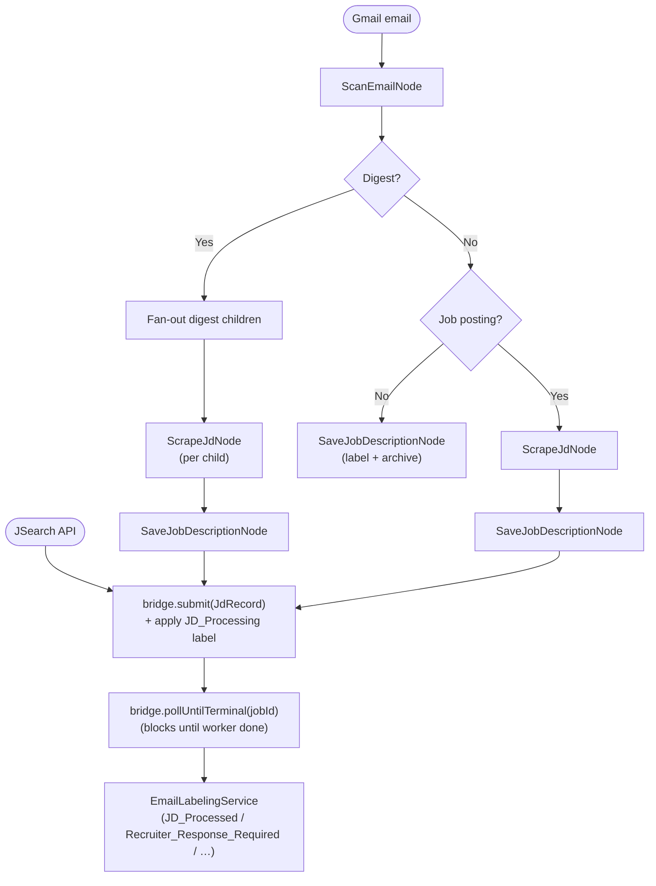
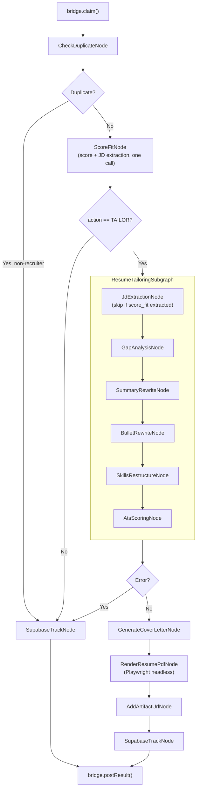

# JD Pipeline (Kotlin)

[](https://github.com/dkkyai/jd-pipeline-kotlin/actions/workflows/ci.yml)
[](LICENSE)
[](https://openjdk.org/projects/jdk/21/)

A Kotlin pipeline that turns inbound job opportunities into tailored resume + cover letter packets, end-to-end. It reads from Gmail or the JSearch API, scores each role against your candidate profile, and — for jobs above the fit threshold — rewrites your resume, generates a cover letter, renders a PDF, and tracks the application in Supabase.

The pipeline is split into two halves connected by the bridge job queue:

- **IngestionPipeline** — scan → scrape → save → submit to bridge
- **ProcessingPipeline** — duplicate-check → score → tailor → PDF → track (run by the worker)

## What it does

- Fetches recruiter emails and job-board digests from Gmail, or pulls live listings from the JSearch API.
- Classifies the email, expands digests into per-job records, and scrapes each job page (HTTP for most boards, Playwright + Chrome profile for LinkedIn).
- Submits each ingested job to the bridge queue and polls for results.
- The worker claims jobs from the queue and runs the processing pipeline: deduplicates, scores fit, runs `ResumeTailoringSubgraph`, renders a tailored HTML + PDF via Playwright.
- Tracks every job in Supabase and, when the source is a recruiter email, drafts a reply with your preferences pre-filled.

## Quick start

After cloning, one command populates every personalised file from your existing resume:

```bash
./gradlew run --args="--init-profile path/to/your_resume.pdf"
```

Supported formats: `.pdf`, `.docx`, `.html`, `.md`.

`--init-profile` parses your resume into a structured `config/candidate_profile.json`, opens `$EDITOR` so you can fill in the preference fields a resume can't supply (visa, comp, work arrangement, …), then renders `generated_resume.html` and `TAILOR_SKILL.md` from your profile.

> You don't need Gmail or Supabase configured to run `--init-profile`. Those layers come in once you want to drive the pipeline from real email or persist scored jobs.

## Pipeline

### Ingestion (`--max-emails`, `--email`, `--jsearch`)



### Processing (`--worker`)



### Tailoring subgraph — what it produces

For every tailored job, `ResumeTailoringSubgraph` writes to `output/<timestamp>_<company>_<role>/`:

| File | Description |
|---|---|
| `tailored_resume.html` | Tailored HTML rendered from your `TailoredProfile` |
| `<AUTHOR_NAME>_<Role>.pdf` | PDF rendered from `tailored_resume.html` via Playwright |
| `tailored_summary.txt` | Rewritten professional summary |
| `tailored_bullets.txt` | Original → rewritten bullet pairs with alignment scores |
| `restructured_skills.txt` | Plain-text skills section ready to copy |
| `ats_score.txt` | ATS scorecard (overall + 5 sub-scores, remaining gaps, top improvements) |
| `gap_analysis.json` | Machine-readable skills gap table |
| `cover_letter.txt` | Tailored cover letter |
| `score_fit.txt` | Fit score, reasoning, strengths, gaps |

## Requirements

- **Java 21** (Temurin / Adoptium recommended)
- **Gradle wrapper** — bundled, use `./gradlew`
- **At least one LLM backend**: local Ollama, MiniMax cloud, DeepSeek cloud, or Ollama Cloud
- **Chrome** (only if you intend to scrape LinkedIn job pages — Playwright launches your Chrome profile)
- **Gmail OAuth credentials** (only if you want to drive the pipeline from your inbox)
- **Supabase project** (only if you want to persist scored jobs)
- **Bridge service running** (`jd-bridge` pm2 process or `./gradlew run` in the bridge directory)

## First-time setup: `--init-profile`

```bash
./gradlew run --args="--init-profile path/to/your_resume.pdf"
```

What it does:

1. Extracts text from the resume.
2. Calls `PROFILE_GEN_MODEL` with `PROFILE_GEN_SKILL.md` to produce a draft `config/candidate_profile.json`.
3. Opens the draft in your `$EDITOR` so you can fill in the ~14 preference fields a resume cannot supply (visa, target compensation, work arrangement, etc.). Save and exit when done.
4. Renders `src/main/resources/resume/generated_resume.html` from `base_resume.template.html` + your profile.
5. Renders `src/main/resources/skills/TAILOR_SKILL.md` from `TAILOR_SKILL.template.md` + a candidate-context block built from your profile.

The three rendered files (`candidate_profile.json`, `generated_resume.html`, `TAILOR_SKILL.md`) are **gitignored** — your personal data never gets committed.

> **Backups:** any pre-existing copy of a generated file is moved aside with a timestamped `.bak` suffix before being overwritten.

## Environment + LLM setup

Copy `.env.example` to `.env` and fill in at least one LLM backend.

### LLM backend (pick one)

| Backend | How to enable | Notes |
|---|---|---|
| **Ollama (local)** | Run `ollama serve`; leave `OLLAMA_LOCAL_BASE_URL=http://localhost:11434` | Free, runs on your machine |
| **Ollama Cloud** | Set `OLLAMA_API_KEY` and append `:ollama-cloud` to any model name | Pay per token |
| **MiniMax** | Set `MINIMAX_API_KEY`, use `:cloud` suffix (e.g. `SCORE_MODEL=MiniMax-M2.7:cloud`) | Strong long-context performance |
| **DeepSeek** | Set `DEEPSEEK_API_KEY`, use `:cloud` suffix (e.g. `SCORE_MODEL=deepseek-reasoner:cloud`) | `deepseek-reasoner` for chain-of-thought scoring |

### Optional integrations

Gmail (drives email-sourced runs):
```bash
./gradlew run --args="--reauth"        # one-time OAuth flow
./gradlew run --args="--check-token"   # verify token
```

Supabase (job tracking): set `SUPABASE_PROJECT_URL` and `SUPABASE_SERVICE_ROLE_KEY` in `.env`.

JSearch (API-driven runs instead of Gmail): set `JSEARCH_API_KEY` and run with `--jsearch`.

## Configuration reference

### Models

All node-level model variables default to `qwen3.5:9b-q4_K_M`. Override per node in `.env`:

| Variable | Used by |
|---|---|
| `SCAN_MODEL` | `ScanEmailNode` — email classification and field extraction |
| `SCRAPE_MODEL` (defaults to `SCAN_MODEL`) | `ScrapeJdNode` — job-page structured extraction |
| `SCORE_MODEL` | `ScoreFitNode` — combined fit scoring + JD structure extraction |
| `RESUME_REASONING_MODEL` | `SummaryRewriteNode`, `BulletRewriteNode` — creative rewriting |
| `SKILLS_MODEL` (defaults to `RESUME_REASONING_MODEL`) | `JdExtractionNode`, `GapAnalysisNode`, `SkillsRestructureNode`, `AtsScoringNode` |
| `COVER_LETTER_MODEL` | `GenerateCoverLetterNode` |
| `DRAFT_REPLY_MODEL` | `CreateDraftReply` |
| `RESUME_GEN_MODEL` | `GenerateResumeHtmlNode` — template + structured profile → HTML resume |
| `PROFILE_GEN_MODEL` (defaults to `RESUME_GEN_MODEL`) | `GenerateCandidateProfileNode` — resume → `candidate_profile.json` |

### Backend routing (`:cloud` and `:ollama-cloud` suffixes)

| Suffix | Routes to |
|---|---|
| (none) | Local Ollama at `OLLAMA_LOCAL_BASE_URL` |
| `:ollama-cloud` | Ollama Cloud (requires `OLLAMA_API_KEY`) |
| `:cloud` with `MiniMax-…` prefix | MiniMax API (requires `MINIMAX_API_KEY`) |
| `:cloud` with `deepseek-…` prefix | DeepSeek API (requires `DEEPSEEK_API_KEY`) |

### Thresholds

| Variable | Default | Description |
|---|---|---|
| `FIT_THRESHOLD` | `50` | Minimum fit score to trigger tailoring |
| `DUPLICATE_WINDOW_DAYS` | `30` | Jobs seen within this window are skipped as duplicates |

### Gmail

| Variable | Default |
|---|---|
| `GMAIL_CREDENTIALS_FILE` | `gmail_credentials.json` |
| `GMAIL_TOKEN_FILE` | `tokens/gmail_token.json` |
| `GMAIL_MAX_EMAILS` | `3` |
| `GMAIL_SEARCH_QUERY` | `newer_than:7d in:inbox -label:JD_Not_Found -label:Recruiter_Response_Required -label:JD_Processing` |

### Bridge

| Variable | Default | Description |
|---|---|---|
| `JD_BRIDGE_URL` | `http://127.0.0.1:8765` | URL the pipeline uses to reach the bridge |

### LinkedIn / Playwright

| Variable | Default |
|---|---|
| `CHROME_EXECUTABLE_PATH` | `/Applications/Google Chrome.app/Contents/MacOS/Google Chrome` (macOS) |
| `CHROME_USER_DATA_DIR` | `~/Library/Application Support/Google/Chrome` (macOS) |
| `CHROME_PROFILE_DIRECTORY` | `Default` |
| `PLAYWRIGHT_TIMEOUT_MS` | `45000` |
| `PLAYWRIGHT_HEADLESS` | `false` |
| `PLAYWRIGHT_FALLBACK_ON_CAPTCHA` | `true` |

## Skills (prompt files)

Prompt files live in `src/main/resources/skills/` and are loaded at runtime — edit without recompiling.

| File | Node | Purpose |
|---|---|---|
| `SCAN_SKILL.md` | `ScanEmailNode` | Email classification and field extraction |
| `SCRAPE_SKILL.md` | `ScrapeJdNode` | Job-page structured extraction |
| `SCORE_SKILL.md` | `ScoreFitNode` | Combined fit scoring + JD structure extraction (runtime-templated via `{{CANDIDATE_PROFILE}}`) |
| `JD_EXTRACTION_SKILL.md` | `JdExtractionNode` | JD structure extraction (fallback when score_fit parse fails) |
| `GAP_ANALYSIS_SKILL.md` | `GapAnalysisNode` | Skills gap table + keyword coverage score |
| `SUMMARY_REWRITE_SKILL.md` | `SummaryRewriteNode` | Professional summary rewrite |
| `BULLET_REWRITE_SKILL.md` | `BulletRewriteNode` | Per-role ATS-aligned bullet rewrite |
| `SKILLS_RESTRUCTURE_SKILL.md` | `SkillsRestructureNode` | Reorder and group skills into JD-aligned categories |
| `ATS_SCORING_SKILL.md` | `AtsScoringNode` | Composite ATS score |
| `DRAFT_REPLY_SKILL.md` | `CreateDraftReply` | Recruiter reply draft |
| `RESUME_GEN_SKILL.md` | `GenerateResumeHtmlNode` | HTML resume generation from structured `TailoredProfile` |
| `PROFILE_GEN_SKILL.md` | `GenerateCandidateProfileNode` | Resume → `candidate_profile.json` |

## Running

```bash
# Compile only
./gradlew compileKotlin

# First time — populate your profile from a resume
./gradlew run --args="--init-profile path/to/your_resume.pdf"

# Batch mode (default: 3 emails from Gmail)
./gradlew run

# Limit email count
./gradlew run --args="--max-emails 10"

# Override env file (e.g. for a speed-tuned cloud config)
./gradlew run --args="--max-emails 5" -Ddotenv.file=.env.speed

# Process a specific email by subject substring
./gradlew run --args='--email "Staff SDET opportunity"'

# JSearch API mode (fetches live listings, bypasses email scan + page scrape)
./gradlew run --args="--jsearch"

# Start the worker (drains the bridge job queue continuously)
./gradlew run --args="--worker"

# Test modes — useful smoke tests, no Gmail/Supabase required
./gradlew run --args="--test"             # end-to-end on a sample JD string
./gradlew run --args="--test-resume"      # tailoring subgraph + PDF render with mock state
./gradlew run --args="--test-coverletter" # cover letter generation
./gradlew run --args="--test-supabase"    # Supabase connectivity
./gradlew run --args="--test-gmail"       # Gmail auth + fetch

# Generate an HTML resume from a DOCX or PDF source (no JD context)
./gradlew run --args='--resume-gen /path/to/resume.docx'
```

### JSearch API mode

Drive the pipeline against the JSearch API to discover live job listings. JSearch results bypass `ScanEmailNode` and `ScrapeJdNode` — the API returns full job descriptions.

```bash
./gradlew run --args="--jsearch"
```

Flow:
1. `JSearchClient.search()` fetches listings from the JSearch API.
2. Each `JobListing` is wrapped in a `JdRecord` and submitted to the bridge queue via `BridgeClient.submit()`.
3. The worker claims and processes each job through `ProcessingPipeline` — deduplication, fit scoring, tailoring, and Supabase tracking.

Required env: `JSEARCH_API_KEY` (RapidAPI key for JSearch).

### Worker mode

The worker runs a continuous poll loop against the bridge queue:

```bash
./gradlew run --args="--worker"
# or via pm2:
pm2 start --name "jd-worker" bash -- -c "cd /path/to/pipeline && ./gradlew run --args='--worker'"
```

Override the bridge URL with `JD_BRIDGE_URL` if the bridge is not on `http://127.0.0.1:8765`.

### Gmail token management

The pipeline uses OAuth 2.0 to authenticate with Gmail. Tokens are stored at `GMAIL_TOKEN_FILE` (default `tokens/gmail_token.json`).

**One-time setup:**
1. Create an OAuth 2.0 Client ID (Desktop app) in the Google Cloud Console and save as `gmail_credentials.json`.
2. Run `./gradlew run --args="--reauth"` — open the displayed URL, authorise, copy the redirect URL back when prompted.

**Manual commands:**
```bash
./gradlew run --args="--check-token"   # verify without fetching emails
./gradlew run --args="--reauth"        # force fresh OAuth
```

## Troubleshooting

### Gmail token issues

| Symptom | Fix |
|---|---|
| "Token EXPIRED" / "Token INVALID" | `./gradlew run --args="--reauth"` |
| "No stored token found" on first run | Ensure `GMAIL_CREDENTIALS_FILE` points to a valid OAuth JSON, then `--reauth` |

### Bridge / worker

| Symptom | Fix |
|---|---|
| "Connection refused" on submit | Bridge is not running — `pm2 start ecosystem.config.js --only jd-bridge` |
| Jobs queued but never processed | Worker is not running — `pm2 start ecosystem.config.js --only jd-worker` |
| `pollUntilTerminal` times out | Worker crashed or is overloaded — check `pm2 logs jd-worker` |

### LinkedIn scraping

| Symptom | Fix |
|---|---|
| "LinkedIn session expired" warning | Re-authenticate Chrome profile used by `CHROME_PROFILE_DIRECTORY` |
| "Security verification" checkpoint | Manually complete in Chrome, then retry |

## Project layout

```
src/main/kotlin/com/jd/pipeline/
├── cli/
│   ├── Main.kt                        # CLI entry point
│   ├── Command.kt                     # Sealed command hierarchy
│   ├── CommandParser.kt               # CLI arg → Command
│   ├── CliOutput.kt                   # Batch summary + warning output
│   ├── EmailLabelingService.kt        # Gmail label / archive / star
│   ├── CreateDraftReply.kt            # Recruiter draft reply
│   └── commands/
│       ├── BatchCommandHandler.kt     # --max-emails: ingest → submit → poll
│       ├── SingleEmailCommandHandler.kt # --email: single email
│       ├── JSearchCommandHandler.kt   # --jsearch: fetch → submit to queue
│       ├── WorkerCommandHandler.kt    # --worker: drain bridge queue
│       └── TestCommandHandler.kt      # --test: smoke test
├── client/
│   ├── BridgeClient.kt                # HTTP client for bridge queue API
│   ├── LlmClient.kt                   # Shared LLM HTTP client
│   ├── SupabaseClient.kt              # Supabase REST client
│   └── gmail/
│       ├── GmailTransport.kt          # Gmail API (fetch, label, draft, archive)
│       └── EmailParser.kt             # MIME parsing
├── config/
│   └── Config.kt                      # All environment variable bindings
├── models/
│   ├── CandidateProfile.kt            # Structured profile
│   └── JobListing.kt                  # JSearch API response model
├── nodes/
│   ├── ScanEmailNode.kt               # Email classification and field extraction
│   ├── ScrapeJdNode.kt                # Job-page scraping (HTTP + Playwright/LinkedIn)
│   ├── SaveJobDescriptionNode.kt      # Persist JD text
│   ├── CheckDuplicateNode.kt          # Supabase-backed dedup
│   ├── ScoreFitNode.kt                # Combined fit scoring + JD structure extraction
│   ├── GenerateCoverLetterNode.kt     # Cover letter
│   ├── RenderResumePdfNode.kt         # Playwright: tailored_resume.html → PDF
│   ├── AddArtifactUrlNode.kt          # Attach artifact URL to state
│   ├── SupabaseTrackNode.kt           # Insert/update job record
│   └── tailor/
│       ├── ResumeTailoringSubgraph.kt # 6-node subgraph entry
│       ├── JdExtractionNode.kt
│       ├── GapAnalysisNode.kt
│       ├── SummaryRewriteNode.kt
│       ├── BulletRewriteNode.kt
│       ├── SkillsRestructureNode.kt
│       └── AtsScoringNode.kt
├── pipeline/
│   ├── IngestionPipeline.kt           # scan → scrape → save
│   └── ProcessingPipeline.kt          # duplicate → score → tailor → PDF → track
├── source/
│   ├── JdRecord.kt                    # Bridge queue payload
│   ├── ProcessingResult.kt            # Worker result returned to bridge
│   └── IntakeContext.kt               # Email / JSearch / Synthetic intake metadata
├── state/
│   └── JDState.kt                     # Immutable pipeline state (data class)
└── utils/
    ├── CandidateProfileRenderer.kt    # Profile → Markdown for LLM prompts
    ├── Json.kt                        # Shared JSON helpers
    ├── NodeTimer.kt                   # Per-node LLM call timing
    ├── OutputUtils.kt                 # Output directory naming
    └── JobFormatter.kt                # Batch summary table formatter

src/main/resources/
├── resume/
│   ├── base_resume.template.html      # Committed structural template
│   └── generated_resume.html          # Gitignored — produced by --init-profile
└── skills/
    ├── *_SKILL.md                     # Committed prompt files, runtime-loaded
    ├── TAILOR_SKILL.template.md       # Committed; rendered to TAILOR_SKILL.md by --init-profile
    └── TAILOR_SKILL.md                # Gitignored — produced by --init-profile

config/
├── candidate_profile.template.json    # Committed schema reference
└── candidate_profile.json             # Gitignored — produced by --init-profile
```

## CI and test reports

A live [Allure report](https://dkkyai.github.io/jd-pipeline-kotlin/) is published from `main` on every push. Locally:

```bash
./gradlew test allureReport            # generates build/reports/allure-report/index.html
./gradlew allureServe                  # opens it in a browser
```

PR runs upload the same report as an `allure-report` artifact on the Actions run.

## Contributing

Issues and pull requests are welcome. Security disclosures go through [SECURITY.md](SECURITY.md).
